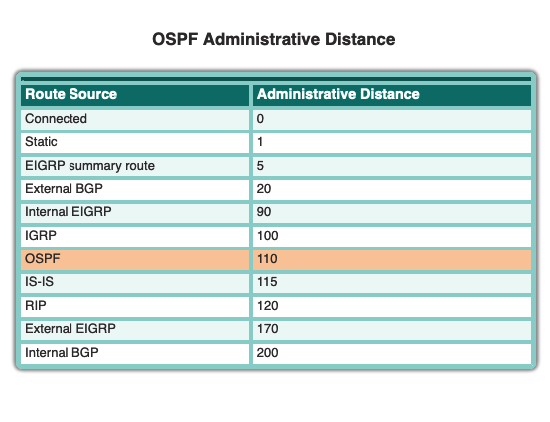
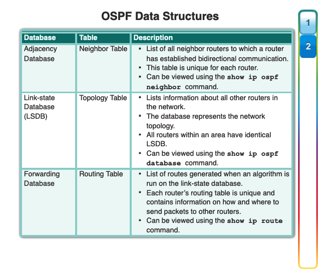
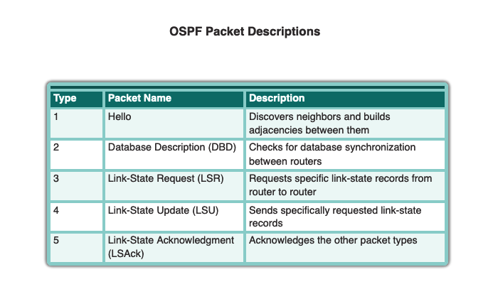

1: Hello Packets

2: LSA

3: LSDB (Topology)

4: SPF Algorithm of Dijkstra 

| Description                     | Command                              |
| ------------------------------- | ------------------------------------ |
| show neighbors                  | show ip ospf neighbor                |
| create point-to-point ospf      | ip ospf network point-to-point       |
| advertise default route in ospf | default-information originate always |
|                                 |                                      |
|                                 |                                      |
|                                 |                                      |
|                                 |                                      |
|                                 |                                      |
|                                 |                                      |

Within hello packet: Router ID in form of ip adress. 

 

**Router ID Veranderen:** 

\- Router OSPF 10 

\- Router-ID 1.1.1.1 0.0.0.0 

 

**if no manual router id >**: Loopback Interface 

**Loopback Interface:** software based

**Configure loopback interface**

\- Interface loopback 0 

\- IP Address 1.1.1.1 255.255.255.255 

 

**DR/BDR election proces:** 

1. Highest priority 
2. Highest router id 

   1. manual
   2. Highestloopback interface adres 
   3. Highest interface ip address 

**OSPF tables:** 

**Adjacency database (Neighbour Table)** 

- Show ip OSPf Neighbor 

**Link-state database (LSDB) (Topology tabel)** 

- Show Ip OSPF Database) 

**Forwarding database (Routing tabel)** 

- Show ip Route 

