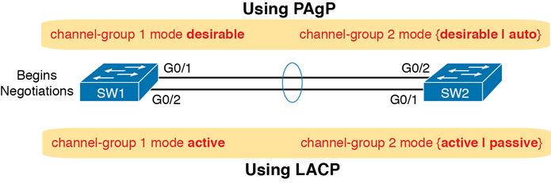

| **Parameters**        | **LACP**                                                     | **PAGP**                                                     |
| --------------------- | ------------------------------------------------------------ | ------------------------------------------------------------ |
| **Origin**            | IEEE passed 802.3ad (LACP) in year 2000                      | Invented in the early 1990s                                  |
| **Vendors Supported** | Open Standard                                                | Cisco Proprietary                                            |
| **Standard**          | Etherchannel and IEEE 802.3ad                                | Etherchannel                                                 |
| **Mode**              | Passive: This mode places a port in a passive negotiating state. In this type of  mode, the port responds to the LACP packets that it receives but does  not initiate LACP packet negotiation. (The default mode for LACP)  Active: This mode places a port in an active negotiation state in which the port initiates negotiations with other ports by sending LACP packets. | Auto: This mode places an interface in a passive negotiating state in which  the interface responds to the PAGP packets that it receives but does not initiate PAGP negotiation. (The default mode for PAGP)  Desirable: This mode places an interface in an active negotiating state in which  the interface initiates negotiations with other interfaces by sending  PAGP packets. |

More information: [link](https://community.fs.com/blog/lacp-vs-pagp-comparison.html)

**Change BridgeID Priority**

- **spanning-tree vlan** \<vlan-id\> **priority** \<value\>

