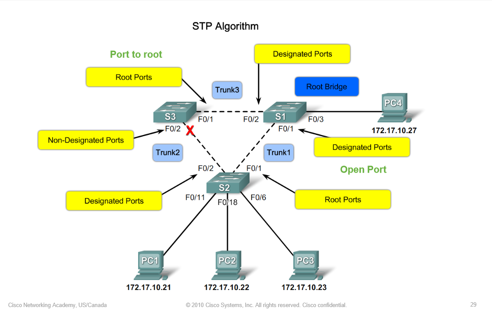

**STP** **(Spanning Tree Protocol):** 

- does block a broadcast storm by switching out an interface. 

 

**Broadcaststorm:** 

- Loop of broadcast messages. 

- You can solve this problem by the spanning tree protocol. The stp elects a root bridge by wich othter switches get less priority. 

  

**Root Bridge:** 

- This is the main switch who sends out the STP messages

 

**Root Election (verkiezing van de Root Bridge requirements):** 

1. Lowes priority (changeable) (wins from mac address) 

2. Lowest mac address. (not changeable) 

 

**Priority Veranderen:** 

- Config t 
- Spanning-tree Vlan 1 priority 4096 
- Spanning-tree vlan 1,2,3,4,5 4096 (Voor vlan 1 t/m 5) 

 

**Show who the root bridge is:**

- Show spanning-tree 

 

A switch has an Mac-address tabl with port number. If a switch sends out a broadcast message this will be out of all the ports!

 

Begrippen: 

| Term                   | Description                                                  |
| ---------------------- | ------------------------------------------------------------ |
| Root ports             | Ports of the switches who are directly connected with the root bridge. This causes that the STP algorithme sends out packets that results in electing the the non-designated port. |
| Designated ports       | all the enabled ports                                        |
| Non-designated ports   | a port what is not enabled                                   |
| Root bridge            | the main switch who serves all the messages                  |
| Root election          | Based on the lowest priority, no priority? Lowest MAC address of the switches. |
| Default priority value | 32768                                                        |

**STP Steps** 

- Step 1: Elect a Root Bridge 
- Step 2: Elect the Root Ports 
- Step 3: Elect the Designated and Non-Designated ports 

**How do you configure a switch to use the newer standard for STP interface costs?**

- spanning-tree pathcost method long

**Root Port:**

- One interface on every non-root bridge with the lowest cost to reach the root bridge.

**Portfast port:**

- Disable spanning tree on a port