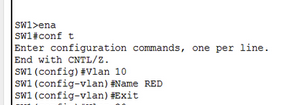
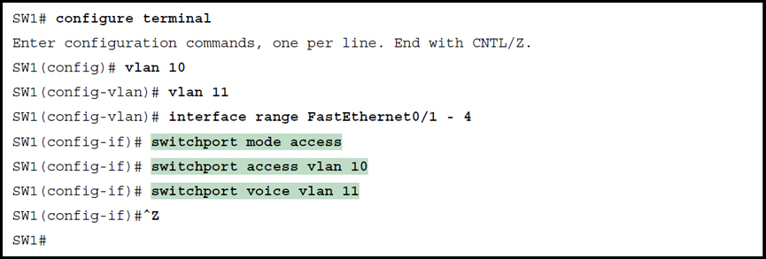

**What is a VLAN?**

- A virtual lan, it's a virtual network. One network can't acces the things on the onther network. By applying this you will get seperation of networks and you will get less broadcast domains.

**Why a VLAN?**

- For the aggregation of multiple hosts to a network, this leads to better security and higher performance.

**Benefits of a VLAN:**

- Security
- Cheaper (Less routers)
- Beter performance
- Easily manageable

**Where is the VLAN info stored?**

- it's stored in a database on the flash memory of a switch (VLAN.dat)

**Setup an VLAN with a name**

**Trunk**

- Multiple vlan's over 1 lankabel (router on a stick)

**Configure trunking:**

- switchport trunk ecapsulation dot1q (interface level)

  

**Subinterface**

- a virtual port over a interface. This is needed beceause on 1 interface can be applied 1 IP address. With subinterfaces you can set up multiple ip address on a fysical port

**Extended:**

- 1006-4094

**How do you assign an interface to a voice VLAN?**

