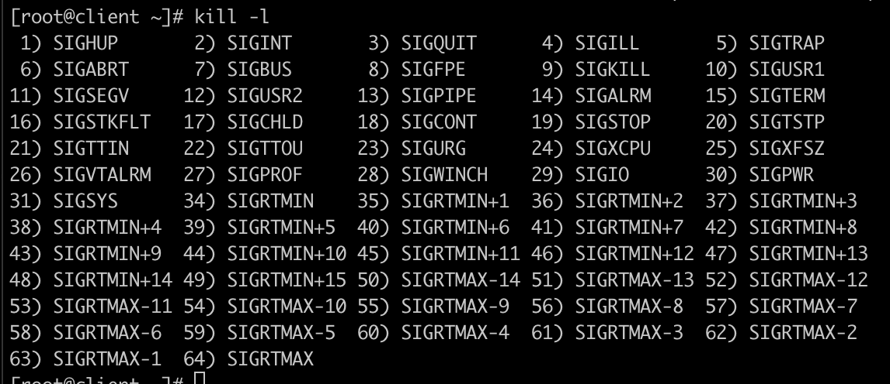
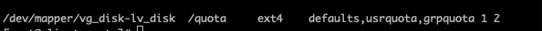

**Force after first login changing a password**

- passwd --expire \<username\>

**Show info about password expiration for a user**

-  chage -l \<username\>

**Grep commands**

**Match on the beginning of the line:**

- grep ^hore food.txt

**Match on the end of the line:**

- grep horen.$ food.txt

**Grep all the lines that not begin with test and end with test but have a word of test in it**

- grep 'test' testfile.txt | grep -v "^[test]" |  grep -v "[test]$"

---------

**Find all files that are not owned by a user**

- find $PWD -name 'name\[0-9\]\[0-9\]' \\! -user student \\! -group student

**Find all open ports**

- netstat -nlutp

**Find all open files by a proces**

- lsof -p 1315

**Find all open files by user**

- lsof -u linda 

**Find all open files by a program**

- lsof -c httpd

**List all the open process on your system**

- ps -elf

**Show all process and the top process**

- Ps -aux --forest

**List all the options for the kill command**

- Kill -l 
- 

**Kill a process**

- kill -9 \<PID\>

**Virsh auto-start machine**

- virsh autostart \<domainname\> 

**Add setgid bit to a file**

- chmod g+s 

**Add setgroupid  bit to a file**

- chmod u+s 

**Add sticky bit to a file**

- Chmod +t 

**Change attribute of a file** 

- Make it immutable

- Chattr +I file 

**Show attributes of a file**

- Lsattr file

**Pipes:**

- 1 >>  = standard output

- 2 >> = standard error 

- & >> standard output + standard error

| **RAID**                                                     |                                          |
| ------------------------------------------------------------ | ---------------------------------------- |
| Yum install mdadm -y                                         | Install mdadm                            |
| mdadm --create --verbose /dev/md0 --level=raid5 --raid-devices=3 /dev/sdb /dev/sdc /dev/sdd | Create a raid setup with 3 devices.      |
| cat /proc/mdstat                                             | show the status of the raid device       |
| mdadm --detail /dev/md0                                      | show info about the raid setup           |
| Mkfs.xfs /dev/md0                                            | create a filesystem                      |
| Mount /dev/md0 /mnt/raid                                     | mounting the filsystesystem to /mnt/raid |
| mdadm --detail --scan > /etc/mdadm.conf                      | Show RAID config and export the config   |

-----

**Quota**

- vi /etc/fstab
- 

**enable quota**

- quotacheck -vug /dev/mapper/vg_disk-lv_disk
- quotaon 

**Edit quota of an user**

- edquota -u \<username\> 
- quotacheck -a 
- quotaon -a 

