| **Mounting** |                                                              |
| ------------ | ------------------------------------------------------------ |
| Mount        | Show all the current mounts                                  |
| findmnt      | Show all the current mounts with its relations               |
| Df -Th       | Show all available disk space with the system mounts (including the filesystem) |
|              |                                                              |

| **Creating a user / group**                    |                                                              |
| ---------------------------------------------- | ------------------------------------------------------------ |
| /etc/login.defs                                | Config file that has been used to store default variables for users etc. |
| Useradd \<username\>                           | Adding a user                                                |
| Passwd \<username\>                            | Changing the password of the user                            |
| Usermod -aG \<groupname\> \<username\>         | Append a user to a group                                     |
| Usermod \<username]> -d \<newhomedirectory\>   | Changing the default homedirectors for a user **excluding** copying the old homefolder data! |
| Usermod \<username\> -m -d <newhomedirectory\> | Changing the default homedirectors for a user **including** copying the old homefolder data! |
| groupmems -g \<groupname\> -l                  | Showing which users a member of a group                      |

| **ACL Linux**         |                                                              |
| --------------------- | ------------------------------------------------------------ |
| Getfacl /             | Get the directory ACL on that folder                         |
| Setfacl \<directory\> |                                                              |
|                       |                                                              |
| SUID                  | Runned file is runned on the SUID bit user (4000) chmod +4000 / chmod u+s |
| SGID                  | Automatically new files created in this folder get the group of the GUID Bit (2000) chmod +2000 / chmod g+s |
| Sticky bit            | Removing files is not allowed by others in this folder (1000) chmod +1000 / chmod +t |

| **File management**  |                                                        |
| -------------------- | ------------------------------------------------------ |
| Ls -R                | Show all files in a directory including subdirectories |
| Cp -R /etc /home/dir | Copies all the files including the subdirectories      |
|                      |                                                        |
|                      |                                                        |
|                      |                                                        |

| **Key-Based Authentication SSH**                             |                                                              |
| ------------------------------------------------------------ | ------------------------------------------------------------ |
| Ssh-keygen -t rsa -b 4096                                    | Creating a key pair (private and public) in the root folder ~/.ssh |
| Ssh folder 700                                               |                                                              |
| Contents in ssh folder 600                                   |                                                              |
| Ssh-copy-id [root@192.168.82.128](mailto:root@192.168.82.128) | Copy the public key to a different host                      |

| **Networking**             |                                                              |
| -------------------------- | ------------------------------------------------------------ |
| Ip link show               | Show the link stat of all the interfaces                     |
| Ip -s link show            | Show the current link statistics (packets sent, received etc.) |
| Ip route show              | Show the default route on the machine                        |
|                            |                                                              |
| Ss -lt                     | Showing all the listening ports on the current system        |
| Nmcli dev status           | Show al the status of all the network interfaces on the host |
| Nmcli dev show \<NICname\> | Show status of a interface                                   |
| Dhclient                   | Refresh the dhcp client to get a new ipaddress               |

| **Packages**                       |                                                              |
| ---------------------------------- | ------------------------------------------------------------ |
| Yum info nmap                      | Show info about a package                                    |
| Yum list \| less                   | Show all the installed packages                              |
| Yum groups list                    | Show all the groups that are available te install            |
| Yum groups info “Basis Web Server” | Show which packages are in the group basic web server        |
|                                    |                                                              |
| Yum history                        | Show which packages you installed en when                    |
| Yum history undo \<number\>        | Undo the action that take place (show info through yum history) |
|                                    |                                                              |

| **Mounting NFS Share**                                       |                                                              |
| ------------------------------------------------------------ | ------------------------------------------------------------ |
| Show mount -e \<IP address of the server\>                   | Showing witch directories are available to make a connection to |
| mount 192.168.82.132:/var/share /var/share                   | Mounting the share                                           |
| 192.168.82.132:/var/share	/var/share/	nfs	defaults	0 0 | Add this row to the /etc/fstab/                              |
| Umount /var/share                                            | Unmount the share on the client                              |
| mount                                                        | Show all the current mounts                                  |
| **AutoFS NFS Share**                                         |                                                              |
| Yum install autofs                                           |                                                              |
| Systemctl enable —now autofs                                 |                                                              |
| 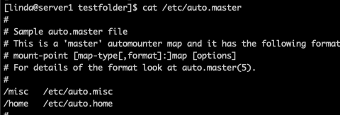 | Vi /etc/auto.master                                          |
| 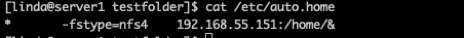 | Vi /etc/auto.home                                            |

| **Journald Log persistant**                                  |                               |
| ------------------------------------------------------------ | ----------------------------- |
| Mkdir -p /var/log/journal                                    |                               |
| vi  [/etc/systemd/journald.conf](https://www.freedesktop.org/software/systemd/man/journald.conf.html) | Edit the journald config file |
| #Storage=auto -> Storage=persistent                          |                               |
| systemctl restart systemd-journald                           | Restart the journald config   |
|                                                              |                               |

| **Executing scripts** |                                                              |
| --------------------- | ------------------------------------------------------------ |
| Source myscript.sh    | Runs the script in the current shell (environment variable will be available in the shell) |
| ./myscripts.sh        | Runs the script in a different shell, after the script is done the environment variables aren’t available anymore |
| $0                    | Name of the script itself when executed in a script          |
| $1, $2 etc.           | Arguments that you can pass into a script                    |
| $?                    | Display the error level                                      |
| $#                    | the number of parameters with which the script has been called |
| $$                    | The PID number of the current running shell                  |

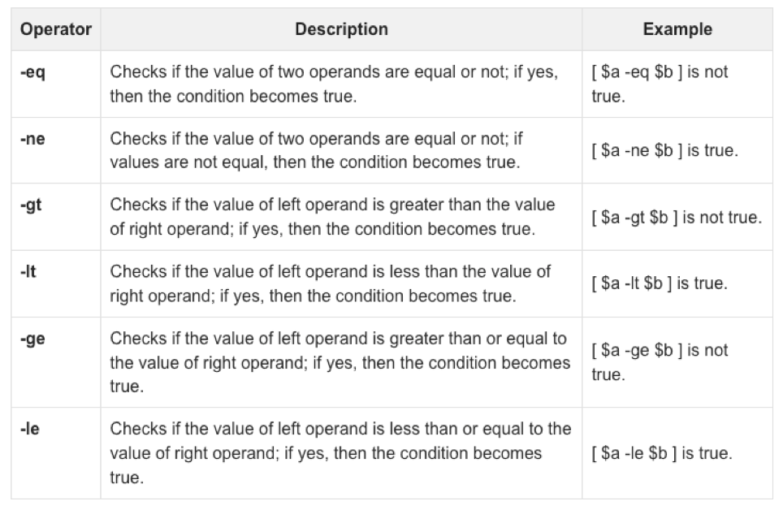

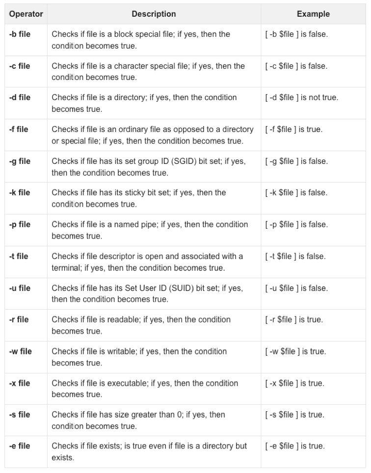

| **Selinux**  |                            |
| ------------ | -------------------------- |
| sestatus     | Show the status of selinux |
| Setenforce 0 | Set selinux to permissive  |
| Setenforce 1 | Set selinux to enforced    |
|              |                            |

| **FACL**                                                     |                                 |
| ------------------------------------------------------------ | ------------------------------- |
| setfacl -m u:\<username\>:\<rights\> \<filename\> setfacl -m u:jan:rwx test.txt    setfacl -m g:\<groupname\>:\<rights\> \<filename\> setfacl -m g:users:rwx test.txt | Set rights for a user and group |
|                                                              |                                 |

| **Modules**             |                                               |
| ----------------------- | --------------------------------------------- |
| lsmod                   | Show all the modules currently running        |
| modinfo \<module name\> | Show info about a module                      |
| /etc/modprobe.d/        | Directory for the config files of the modules |
|                         |                                               |

| **Custom Repo** |                         |
| --------------- | ----------------------- |
| Yum repolist    | Update the repositories |
|                 |                         |
| Yum clean all   | Reload the cache        |
|                 |                         |

| **Firewalld**                             |                                                         |
| ----------------------------------------- | ------------------------------------------------------- |
| Firewall-cmd —add-service=http —permanent | Add a service                                           |
| firewall-cmd —add-port=80/tcp —permanent  | Add a port                                              |
| firewall-cmd —reload                      | Reload the firewall                                     |
| firewall-cmd —list-services               | Show witch services are allowed throughout the firewall |
| firewall-cmd —list-ports                  | Show all the ports that are been enabled                |
| Systemctl status firewalld.service        | Show the status of the firewall Deamon                  |

| Yum install crony        |                       |
| ------------------------ | --------------------- |
| Chronyc tracking         |                       |
| Chronyc sources -v       |                       |
| /etc/chrony.conf         |                       |
| Systemctl status chronyd | **Chronyd With a d!** |

| **Selinux**                                          |                                         |
| ---------------------------------------------------- | --------------------------------------- |
| Semanage port -l                                     | List of all the ports                   |
| semanage port -a -t http_port_t -p tcp 90            | Change the default http port to port 90 |
| Getsebool -a                                         |                                         |
| Setsebool -P \<boolean name\> (from getsebool) on/of |                                         |
| yum install selinux-policy-doc                       |                                         |
|                                                      |                                         |

| **Podman enabling auto start container**                     |                                                              |
| ------------------------------------------------------------ | ------------------------------------------------------------ |
| podman run -d --name web -p 8888:8080 -v /home/containerdata:/var/www/html:Z -e HTTPD_MPM=event [registry.redhat.io/rhel8/httpd-24:1-112.1599745027](http://registry.redhat.io/rhel8/httpd-24:1-112.1599745027) | Creating a container                                         |
| Cd /etc/systemd/system                                       | Changing the directory to the right location                 |
| Sudo podman generate systemd —name \<container\> --files     |                                                              |
| Login as the user and then -> ~/.config/systemd/user         | Location where the service must be                           |
| Systemctl —user daemon-reload **(with ae)**                  |                                                              |
| Systemctl —user enable container-web.service                 |                                                              |
| setsebool -P container_manage_cgroup on                      |                                                              |
|                                                              |                                                              |
| Loginctl enable-linger \<username\>                          | Enable this so that the container can start automatically as the system boots |
|                                                              |                                                              |

| **Copy logs to directory**                   |      |
| -------------------------------------------- | ---- |
| cp -R /var/log/journal/* /home/ldapuser1/log |      |

| **Powersaving profiles**         |                                       |
| -------------------------------- | ------------------------------------- |
| tuned-adm active                 | Show the current active tuned profile |
| tuned-adm list                   | Show all the tuning profiles          |
| tuned-adm profile <profile-name> | Setting the default tuning profile    |
| Systemctl enable —now tuned      | Enable tuned                          |

| **Root password reset:**                                     |                                                              |
| ------------------------------------------------------------ | ------------------------------------------------------------ |
| Press “e” on boot menu                                       |                                                              |
| Add rd.break to the linux line    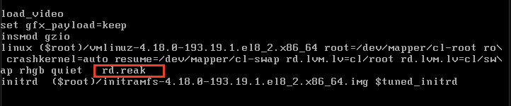 | The rd.break parameter interrupts the boot process before the control is passed over to the kernel. |
| Cntrl x 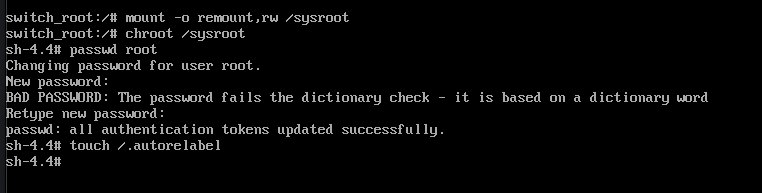 |                                                              |
|                                                              |                                                              |
|                                                              |                                                              |
| **Grub Changing default target**                             |                                                              |
| Press “e” on boot menu                                       |                                                              |
| 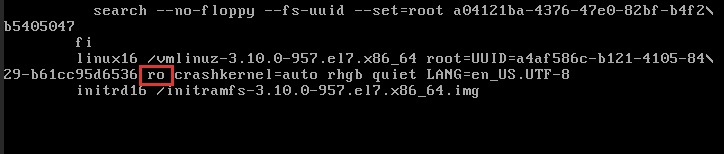  To  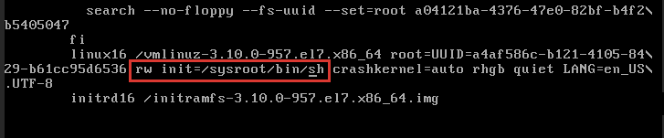 |                                                              |
| Cntrl x                                                      |                                                              |
|                                                              |                                                              |
|                                                              |                                                              |

| **Grub changing config**                                     |                                                  |
| ------------------------------------------------------------ | ------------------------------------------------ |
| Vi /etc/default/grub                                         | Changing some settings within the grub config    |
| grub2-mkconfig -o /boot/grub2/grub.cfg                       | Writing the config file to the boot config file. |
| 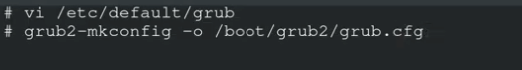 |                                                  |
|                                                              |                                                  |

| **Volumes**                        |                                                              |
| ---------------------------------- | ------------------------------------------------------------ |
| Lsblk                              | List all the block devices                                   |
| Pvcreate                           | Creating a physical volume                                   |
| Vgcreate /dev/sdb                  | Creating a volume group                                      |
| lvcreate -L 500mb -n lvprac vgprac | Creating a logical volume                                    |
| Mkfs.xfs /dev/sdb                  | Creating a filesystem                                        |
| Df /mnt/lvdrive                    | Show disk usage of that folder **including** the mount paths of those folder |

| **Extend filesystem**                  |                                |
| -------------------------------------- | ------------------------------ |
| Lvextend -L +1GB /dev/vg_disk/lv_disk3 | Extend the filesystem with 1GB |
| resize2fs /dev/vg_disk/lv_disk         | Resize the filesystem          |

| **Volumes Show** |                       |
| ---------------- | --------------------- |
| Pvscan           | Scan physical volumes |
| Vgscan           | Scan volume groups    |
| Lvscan           | Scan ogical volumes   |
| Pvdisplay        | List physical volumes |
| Vgdisplay        | List volume groups    |
| Lvdisplay        | List logical volumes  |

| **Find**                                          |      |
| ------------------------------------------------- | ---- |
| find / -user jan -exec tar -cvzf file.tar.gz {} + |      |
| find / -user peter -exec cp {} /root/backup \;    |      |

| **Swap**                                                     |                                                              |
| ------------------------------------------------------------ | ------------------------------------------------------------ |
| First create a LV disk that you want to enable for swap with Lvcreate ! |                                                              |
| Parted /dev/vg_disk/lv_disk2                                 |                                                              |
| 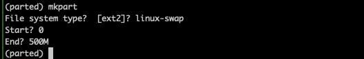 |                                                              |
| Mkswap /dev/vdb1                                             | Makeswap partition                                           |
| Free -m                                                      | Showing how many swap space there is before                  |
| Swapon /dev/vdb1                                             | Enable the swap partition                                    |
| Free -m                                                      | Showing how many swap space there is now                     |
| /etc/fstab   | Enable to the /etc/fstab                                     |
| Mount -a                                                     |                                                              |
| Ls -l /dev/mapper                                            | Dm-0 etc. should be the names corresponding to the output of swapon -s |

| **Stratis**                                                  |                                   |
| ------------------------------------------------------------ | --------------------------------- |
| Dnf install stratisd stratis-cli straits                     |                                   |
| Systemctl enable —now stratisd                               | Enable stratis deamon             |
|                                                              |                                   |
| **Check if the devices don’t have a partition table**        |                                   |
| Blkid -p /dev/sdb                                            | Should be a empty string          |
| wipefs -a /dev/sdb                                           | Wipe filesystem if that exists    |
|                                                              |                                   |
| Stratis pool create \<name\> \<block device\> Eq. Stratis pool create stratis_pool /dev/sdb /dev/sdc | Creating a pool                   |
| stratis pool add-data stratis_pool /dev/sdd                  | Adding a drive to the pool        |
| stratis fs create \<stratis pool\> \<filesystem type\>       | Creating a filesystem             |
|                                                              |                                   |
| Mount /stratis/stratis_pool/xfs /mnt/xfs_stratis             | Mounting the filesystem           |
| Blkid -p /stratis/stratis_pool/xfs                           | Getting the block id of the drive |
| Write the mount to the /etc/fstab file for mounting when booting    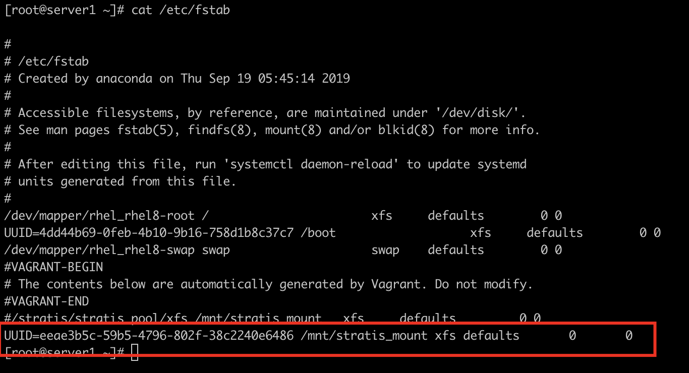 |                                   |

| **VDO**                                                      |                                          |
| ------------------------------------------------------------ | ---------------------------------------- |
| Yum install vdo kmod-vdo                                     |                                          |
| Systemctl enable --now vdo                                   |                                          |
| Vdo create —name=vdo1 --device=/dev/sdb --vdoLogicalSize=100G |                                          |
| Vdostats --human-readable                                    |                                          |
| Pvcreate /dev/mapper/vdo1                                    |                                          |
| Vgcreate vg_vdo1 /dev/mapper/vdo1                            |                                          |
| Lvcreate -L 50G —name=lv_vdo1 vg_vdo1 Lvcreate -L 50G —name=lv_vdo2 vg_vdo1 |                                          |
| Mkfs.xfs -K /dev/mapper/vg_vdo1-lv_vdo1 Mkfs.xfs -K /dev/mapper/vg_vdo1-lv_vdo2 |                                          |
| Mount in the fstab  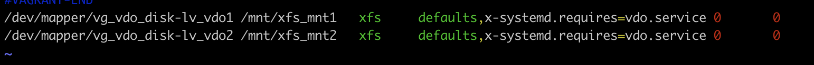 |                                          |
| Df -hT                                                       | Show human readable and filesystem types |
|                                                              |                                          |

| **TAR**                              |                                                              |
| ------------------------------------ | ------------------------------------------------------------ |
| -t                                   | Shows the full archive                                       |
|                                      |                                                              |
| **ZIP**                              |                                                              |
| Zip test.zip file1.txt               | Zipping a file                                               |
| **Gzip**                             | Open source zip file format                                  |
| Tar -czvf \<files\> \<filename\>.gz  | -c = create -z = gzip -v = verbose (display each file name) -f = file |
| Tar -xzvf \<filename\>.gz            | -x = extract -z = gzip -v = verbose (display each file name) -f = file |
| **Bzip2**                            | Higher compression then Gzip                                 |
| Tar -cjvf \<files\> \<filename\>.bz2 | -c = create -j = bzip2 -v = verbose (display each file name) -f = file |
| Tar -xjvf \<filename\>.bz2           | -x = extract -j = bzip2 -v = verbose (display each file name) -f = file |
| **Xz**                               | Highest compression but slower                               |
| tar -cJvf                            | -c = create -J = XZ -v = verbose (display each file name) -f = file |
| Tar -xJvf                            | -x = extract -J = XZ -v = verbose (display each file name) -f = file |

